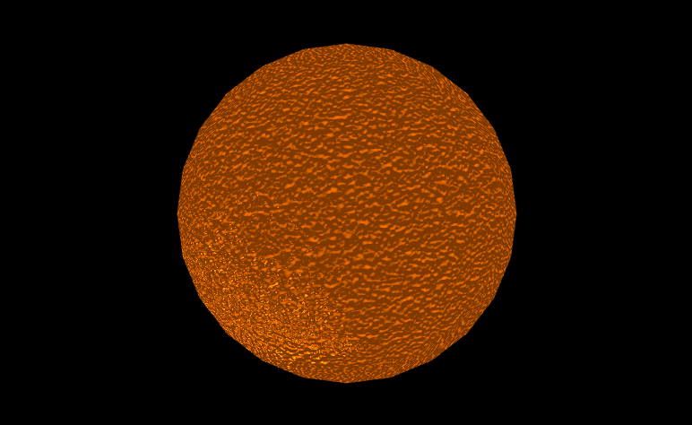

# Normal-Mapping-WebGL
WebGL implementation of normal mapping for CG class

For bump mapping checkout ```bump-mapping``` branch

Command to run the web application: ```npm install```
and then: ```npm start```


